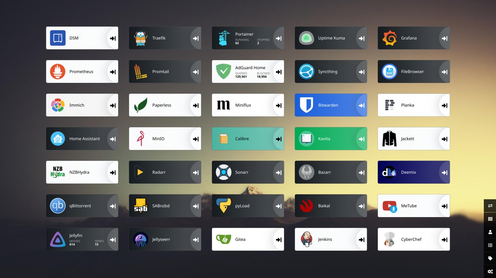

# Homelab

A collection of Docker Compose files used in my Homelab.

## Requirements

- [Docker](https://docs.docker.com/get-docker/)
- [Docker Compose](https://docs.docker.com/compose/install/)

## Getting started

Check out the [Traefik readme](traefik/README.md) first.

## Useful Links

- [Awesome-Selfhosted](https://github.com/awesome-selfhosted/awesome-selfhosted)
- [r/selfhosted](https://www.reddit.com/r/selfhosted)
- [r/homelab](https://www.reddit.com/r/homelab)

## License

This project is licensed under the [MIT license](LICENSE).
