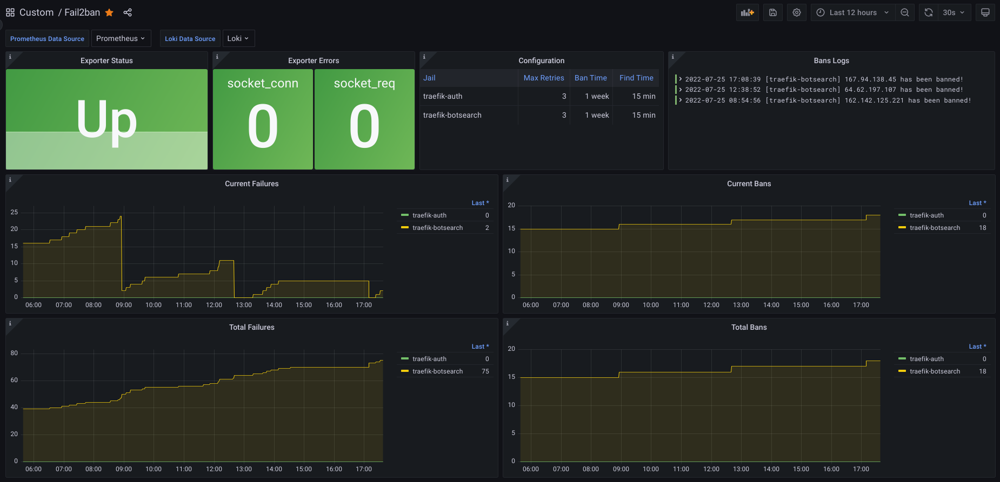

# Fail2ban

- [About](#about)
- [Requirements](#requirements)
- [Configuration](#configuration)
  * [Telegram notifications](#telegram-notifications)
  * [Prometheus config](#prometheus-config)
  * [Docker setup](#docker-setup)
  * [Grafana dashboard](#grafana-dashboard)
- [Useful links](#useful-links)

## About

Fail2Ban scans log files like `/var/log/auth.log` and bans IP addresses
conducting too many failed login attempts.

It does this by updating system firewall rules to reject new connections from
those IP addresses, for a configurable amount of time. Fail2Ban comes
out-of-the-box ready to read many standard log files, such as those for sshd and
Apache, and is easily configured to read any log file of your choosing, for any
error you wish.

## Requirements

- [Telegram Bot token (optional)](https://core.telegram.org/bots)

## Configuration

### Telegram notifications

First we need to talk to the
[BotFather](https://core.telegram.org/bots#6-botfather) and follow a few simple
steps to get an authentication token. Then we can create a channel or use our
personal chat ID to receive the notifications. After that it is just necessary
to configure the environment variables:

```yaml
environment:
  - TELEGRAM_AUTH_TOKEN=$TELEGRAM_AUTH_TOKEN
  - TELEGRAM_CHAT_ID=$TELEGRAM_CHAT_ID
```

Enable the custom action in the Fail2ban jail configuration:

```ini
[traefik-botsearch]
action = iptables-multiport[port="http,https",chain="FORWARD"] telegram-notifications
```


### Prometheus config

To collect Fail2ban metrics from Prometheus ensure to add the next configuration
in `prometheus.yml` file:

```yml
scrape_configs:
  - job_name: fail2ban
    static_configs:
      - targets:
          - fail2ban_exporter:9191
    scrape_interval: 1m
    scrape_timeout: 5s
```

### Docker setup

We create a `.env` file:

```shell
DOCKER_DATA="/docker/data"
DEFAULT_NETWORK="badassnet"
TZ="Europe/Madrid"
TELEGRAM_AUTH_TOKEN="superBotSecret"
TELEGRAM_CHAT_ID="myChatID"
```

And deploy:

    docker-compose up -d

### Grafana dashboard

A sample Grafana dashboard can be found [here](grafana/dashboard.json).



## Useful links

- [Fail2ban](https://www.fail2ban.org/)
- [Fail2ban Traefik example](https://github.com/crazy-max/docker-fail2ban/tree/master/examples/jails/traefik)
- [Using Fail2ban with Traefik](https://geekland.eu/usar-fail2ban-con-traefik-para-proteger-servicios-que-corren-en-docker/)
- [Fail2ban Telegram notifications](https://github.com/deividgdt/fail2ban_telegram_notifications)
- [Fail2ban Prometheus Exporter](https://gitlab.com/hectorjsmith/fail2ban-prometheus-exporter)
