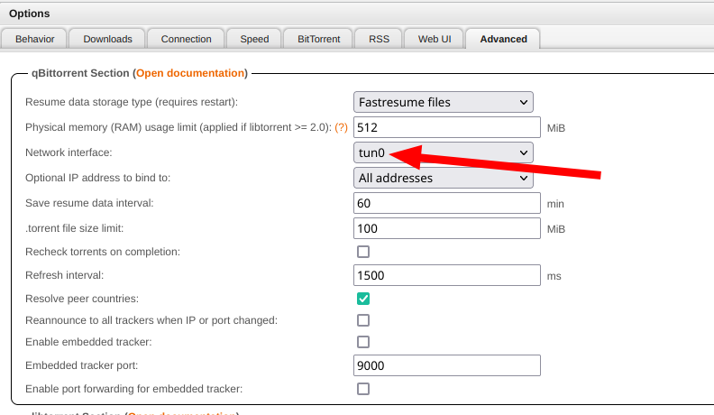

# qBittorrent

- [About](#about)
- [Requirements](#requirements)
- [Configuration](#configuration)
  * [Docker setup](#docker-setup)
  * [Avoid IP Leak](#avoid-ip-leak)
  * [Authelia setup](#authelia-setup)
- [Useful links](#useful-links)

## About

qBittorrent is a fast and stable bittorrent client programmed in C++ / Qt that
uses libtorrent. If we want download torrents [anonymously](https://iknowwhatyoudownload.com/en/peer/) we will need a VPN too.

[Gluetun VPN client](https://github.com/qdm12/gluetun) makes routing containers' traffic through OpenVPN or [WireGuard](https://www.wireguard.com/) easy.

## Requirements

- VPN service (like [ProtonVPN](https://protonvpn.com))

## Configuration

### Docker setup

We create a `.env` file:

```shell
DOCKER_DATA="/docker/data"
DOWNLOADS_DATA="/downloads"
DEFAULT_NETWORK="badassnet"
DOMAIN_NAME="domain.tld"
SUBDOMAIN="qbittorrent"
PUID=1000
PGID=1000
TZ="Europe/Madrid"
DNS=1.1.1.1
VPN_SERVICE_PROVIDER="protonvpn"
VPN_TYPE="wireguard"
WIREGUARD_PRIVATE_KEY="supersecret"
SERVER_COUNTRIES="Spain"
PORT_FORWARD_ONLY="on"
```

And deploy:

    docker-compose up -d

After deploying we can verify the qBittorrent container traffic goes through the
OpenVPN:

```shell
user@host:~$ curl ifconfig.me
xxx.xxx.xxx.xxx # Should be your public IP
user@host:~$ docker exec -it qbittorrent curl ifconfig.me
xxx.xxx.xxx.xxx # Should be the VPN provider IP
```

### Avoid IP Leak

To ensure qBittorrent does not leak our real IP address, configure it to use only the VPN interface (by default, it uses all available interfaces, more info [here](https://www.reddit.com/r/qBittorrent/comments/14bzdct/psa_qbittorrent_leaks_your_real_ip_when_using_vpn/)). Go to: Options -> Advanced -> Network Interface -> Select the VPN interface (`tun0`).



### Authelia setup

It's necessary to bypass `/api` if you want to use a third party application as [nzb360](https://nzb360.com).

Add the next rule to the Authelia `configuration.yml`:

```yml
access_control:
  default_policy: deny
  rules:
    - domain: qbittorrent.domain.tld
      policy: bypass
      resources:
        - '^/api.*$'
```

## Useful links

- [qBittorrent](https://www.qbittorrent.org/)
- [Linuxserver qBittorent Docs](https://docs.linuxserver.io/images/docker-qbittorrent)
- [WireGuard](https://www.wireguard.com/)
- [ProtonVPN](https://protonvpn.com)
- [Gluetun VPN client](https://github.com/qdm12/gluetun)
