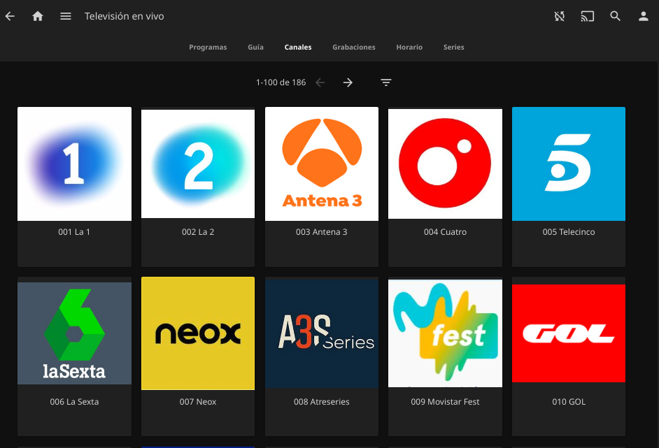

# UDPXY

- [About](#about)
- [Requirements](#requirements)
- [Configuration](#configuration)
  * [Docker setup](#docker-setup)
  * [Jellyfin integration](#jellyfin-integration)
- [Useful links](#useful-links)

## About

UDPXY is a data stream relay: it reads data streams from a multicast groups
(RTP/UDP) and forwards the data to the requesting clients (HTTP subscribers).
This translates into being able to see the content of our TV cable operator on
any device in the home.

This can be used in Jellyfin to watch live TV.

## Requirements

- A TV cable operator

## Configuration

### Docker setup

Just deploy:

    docker-compose up -d

### Jellyfin integration

It's necessary to generate a `.m3u8` playlist. For example:

```yaml
#EXTM3U
#EXTINF:-1 channel-id="001" tvg-id="Neox.TV" group-title="Generalistas",Neox
http://<UDPXY_HOST_IP>:2112/udp/239.0.5.207:8208
#EXTINF:-1 channel-id="002" tvg-id="MovistarFest.TV" group-title="Generalistas",Movistar Fest
http://<UDPXY_HOST_IP>:2112/udp/239.0.5.208:8208
#EXTINF:-1 channel-id="003" tvg-id="GOL.TV" group-title="Generalistas",GOL
http://<UDPXY_HOST_IP>:2112/udp/239.0.5.189:8208
```

We save this `.m3u8` playlist in our LiveTV volume:

```yml
volumes:
  - /volume1/media/LiveTV:/data/livetv:ro
```

And we load the playlist from [Jellyfin settings](https://jellyfin.org/docs/general/server/live-tv/setup-guide.html#m3u-tuner-specific-options).



## Useful links

- [UDPXY](http://www.udpxy.com/)
- [UDPXY Docker](https://github.com/Lordpedal/udpxy)
- [Instalar udpxy en Raspberry Pi para ver Movistar+](https://bytelix.com/guias/instalar-udpxy-raspberry-pi-ver-movistar/)
- [Lista de canales de Movistar+ para ver en VLC](https://www.adslzone.net/foro/movistar-tv-imagenio.38/lista-actualizada-canales-vlc.350532/)
