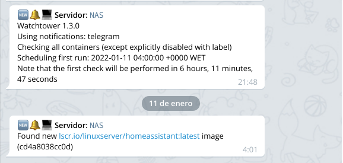

# Watchtower

- [About](#about)
- [Requirements](#requirements)
- [Configuration](#configuration)
  * [Watchtower arguments](#watchtower-arguments)
  * [Telegram notifications](#telegram-notifications)
  * [Docker setup](#docker-setup)
- [Useful links](#useful-links)

## About

Although we should always avoid using the `latest` Docker tag in production
environments, at home it gives us the garantee to be up to date when a new
security update is applied.

With Watchtower we can update the running version of our containerized app
simply by pushing a new image to the Docker Hub or our own image registry.
Watchtower will pull down our new image, gracefully shut down our existing
container and restart it with the same options that were used when it was
deployed initially.

## Requirements

- [Telegram Bot token](https://core.telegram.org/bots)

## Configuration

### Watchtower arguments

We can configure Watchtower to update the running versions or simply get
notified when a new version it is available without updating containers:

```yaml
environment:
  - WATCHTOWER_MONITOR_ONLY=true
```

We can define a cron expression (in 6 fields) which defines when and how often
to check for new images:

```yaml
environment:
  - WATCHTOWER_SCHEDULE=0 0 4 * * ?
```

We can ensure to remove old images after updating:

```yaml
environment:
  - WATCHTOWER_CLEANUP=true
```

All the available arguments can be found [here](https://containrrr.dev/watchtower/arguments/).

### Telegram notifications

First we need to talk to the
[BotFather](https://core.telegram.org/bots#6-botfather) and follow a few simple
steps to get an authentication token. Then we can create a channel or use our
personal chat ID to receive the notifications. After that it is just necessary
to configure the environment variables:

```yaml
environment:
  - WATCHTOWER_NOTIFICATIONS=shoutrrr
  - WATCHTOWER_NOTIFICATION_URL=telegram://$TELEGRAM_AUTH_TOKEN@telegram?channels=$TELEGRAM_CHAT_ID&parseMode=HTML
  - WATCHTOWER_NOTIFICATION_TEMPLATE=🆕🔔💻 <b>Servidor:</b> <code>NAS</code>{{println}}{{range .}}{{.Message}}{{println}}{{end}}
```



### Docker setup

We create a `.env` file:

```shell
DOCKER_DATA="/docker/data"
DEFAULT_NETWORK="badassnet"
TZ="Europe/Madrid"
TELEGRAM_AUTH_TOKEN="superBotSecret"
TELEGRAM_CHAT_ID="myChatID"
```

And deploy:

    docker-compose up -d

## Useful links

- [Watchtower](https://containrrr.dev/watchtower)
- [Watchtower Arguments](https://containrrr.dev/watchtower/arguments/)
- [Watchtower Notifications](https://containrrr.dev/watchtower/notifications/)
- [Shoutrrr Telegram notifications](https://containrrr.dev/shoutrrr/v0.5/services/telegram/)

